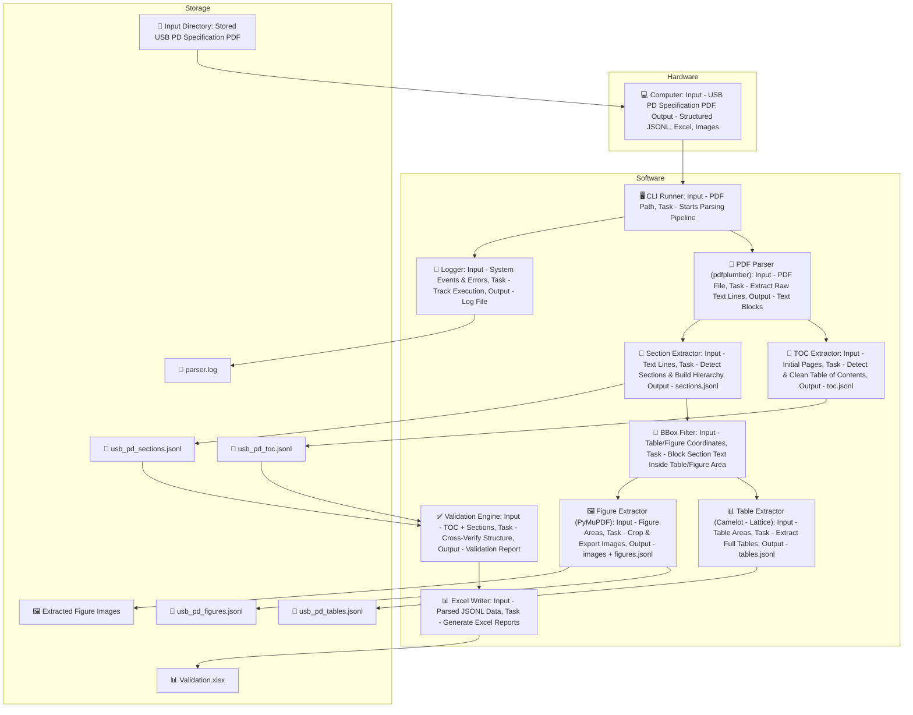

```mermaid
graph TD

%% Hardware
subgraph Hardware
    Computer["💻 Computer: Input - USB PD Specification PDF, Output - Structured JSONL, Excel, Images"]
end

%% Software
subgraph Software
    CLI["🖥️ CLI Runner: Input - PDF Path, Task - Starts Parsing Pipeline"]
    
    PDFParser["📄 PDF Parser (pdfplumber): Input - PDF File, Task - Extract Raw Text Lines, Output - Text Blocks"]
    
    TOCExtractor["📑 TOC Extractor: Input - Initial Pages, Task - Detect & Clean Table of Contents, Output - toc.jsonl"]
    
    SectionExtractor["📘 Section Extractor: Input - Text Lines, Task - Detect Sections & Build Hierarchy, Output - sections.jsonl"]
    
    TableExtractor["📊 Table Extractor (Camelot - Lattice): Input - Table Areas, Task - Extract Full Tables, Output - tables.jsonl"]
    
    FigureExtractor["🖼️ Figure Extractor (PyMuPDF): Input - Figure Areas, Task - Crop & Export Images, Output - images + figures.jsonl"]
    
    BBoxFilter["📐 BBox Filter: Input - Table/Figure Coordinates, Task - Block Section Text Inside Table/Figure Area"]
    
    Validator["✅ Validation Engine: Input - TOC + Sections, Task - Cross-Verify Structure, Output - Validation Report"]
    
    ExcelWriter["📊 Excel Writer: Input - Parsed JSONL Data, Task - Generate Excel Reports"]
    
    Logger["📝 Logger: Input - System Events & Errors, Task - Track Execution, Output - Log File"]
end

%% Storage
subgraph Storage
    InputFolder["📁 Input Directory: Stored USB PD Specification PDF"]
    
    SectionFile["📄 usb_pd_sections.jsonl"]
    TOCFile["📄 usb_pd_toc.jsonl"]
    TableFile["📄 usb_pd_tables.jsonl"]
    FigureFile["📄 usb_pd_figures.jsonl"]
    ImageFolder["🖼️ Extracted Figure Images"]
    ExcelFile["📊 Validation.xlsx"]
    LogFile["📝 parser.log"]
end

%% Connections
InputFolder --> Computer
Computer --> CLI
CLI --> PDFParser
PDFParser --> TOCExtractor
PDFParser --> SectionExtractor

SectionExtractor --> BBoxFilter
BBoxFilter --> TableExtractor
BBoxFilter --> FigureExtractor

SectionExtractor --> SectionFile
TOCExtractor --> TOCFile
TableExtractor --> TableFile
FigureExtractor --> FigureFile
FigureExtractor --> ImageFolder

SectionFile --> Validator
TOCFile --> Validator
Validator --> ExcelWriter
ExcelWriter --> ExcelFile

CLI --> Logger
Logger --> LogFile
```